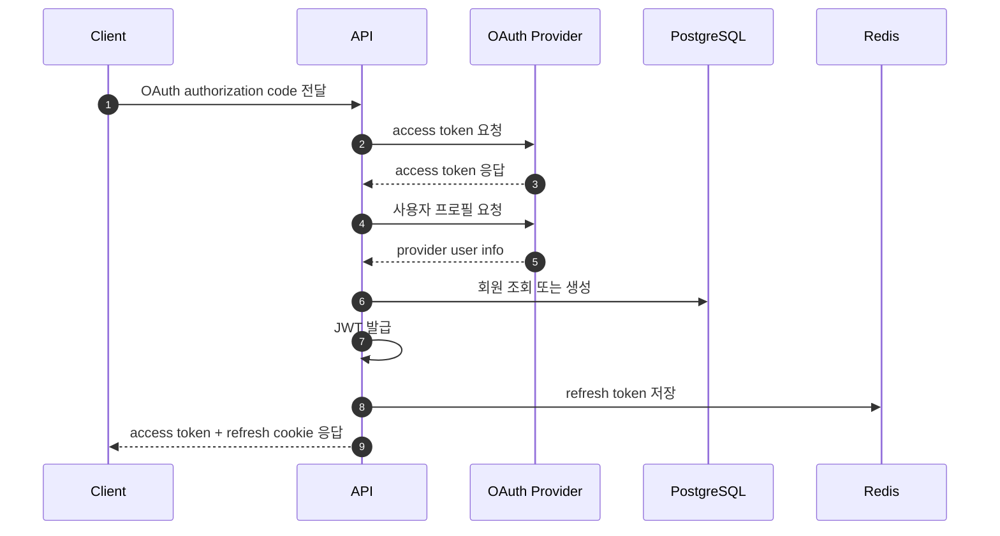
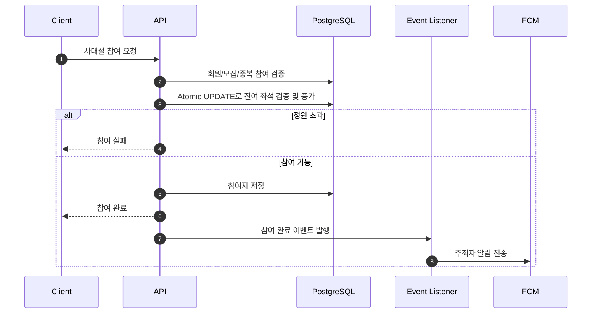
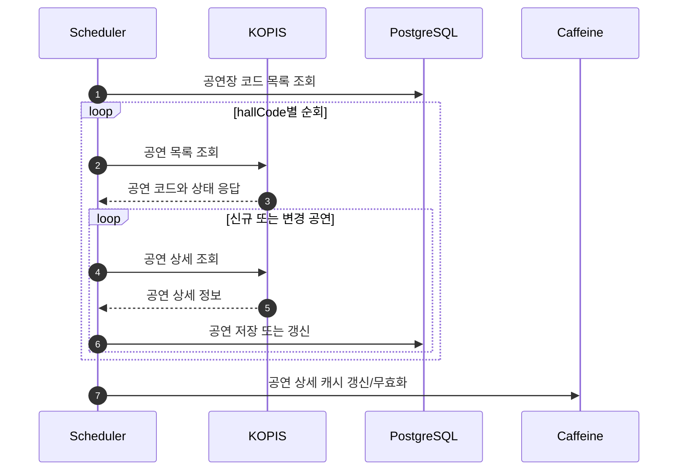

# Main Sequences

## OAuth Login

클라이언트가 OAuth authorization code를 전달하면 서버가 provider와 직접 통신해 사용자 정보를 조회합니다. 이후 로컬 회원을 식별하고 JWT access token과 refresh token을 발급합니다.

## Rent Participation

차대절 참여 요청은 회원, 모집, 중복 참여 여부를 검증한 뒤 좌석 수를 갱신합니다. 정원 초과를 막기 위해 잔여 좌석 검증과 증가를 하나의 atomic update로 처리합니다.

## KOPIS Concert Sync

스케줄러가 KOPIS API에서 공연장별 공연 목록을 조회하고, 신규 공연 또는 상태가 변경된 공연만 상세 조회해 저장합니다. 공연 상세 조회 성능을 위해 캐시 갱신 흐름도 함께 관리합니다.

