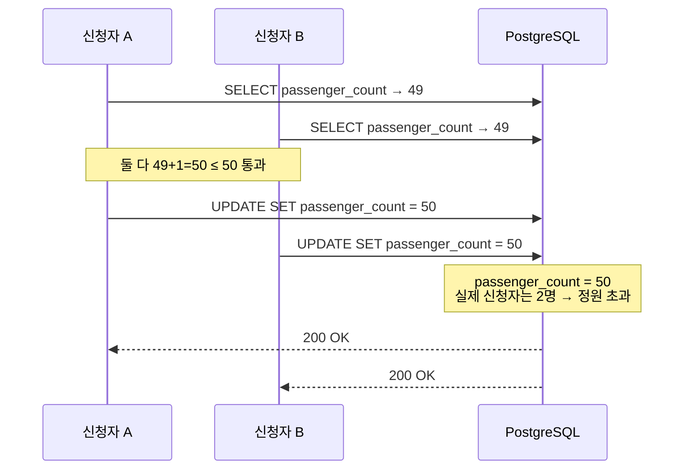
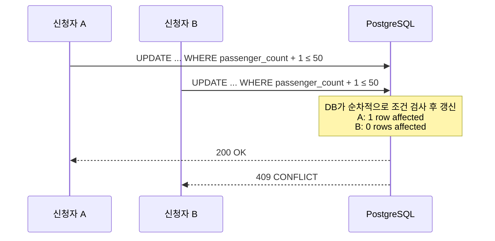

# 차량 대절 동시 신청 Lost Update 해결 — Atomic UPDATE로 정합성 보장

# 전체 아키텍처

### Before — Lost Update 발생



### After — Atomic UPDATE 적용



# 문제 상황

차량 대절 신청 기능에는 현재 신청 인원을 빠르게 조회하기 위해 `passenger_count` 컬럼을 두고 있었습니다. 문제는 신청 가능 여부를 검사하고, 그 값을 증가시키는 과정이 `SELECT → 검증 → UPDATE`로 나뉘어 있었다는 점입니다.

이 구조에서는 두 요청이 거의 동시에 들어왔을 때 둘 다 같은 값을 읽을 수 있습니다. 예를 들어 정원이 1명 남은 상황에서 두 사용자가 동시에 신청하면, 두 요청 모두 "아직 자리가 있다"고 판단한 뒤 각각 업데이트를 시도하게 됩니다. 그 결과 실제로는 정원이 초과됐는데도 둘 다 성공하는 Lost Update가 발생할 수 있었습니다.

선착순 신청에서는 이 문제가 더 치명적이었습니다. 한두 건의 오차가 아니라, 정원이 꽉 찬 뒤에도 성공 응답이 나갈 수 있기 때문입니다.

# 해결 과정

해결 방법을 정하기 전에 몇 가지 대안을 먼저 비교했습니다.

### 낙관적 락

버전 충돌이 나면 재시도하는 방식입니다. 하지만 선착순 신청처럼 짧은 시간에 동시 요청이 몰리는 상황에서는 충돌이 연달아 발생하기 쉽습니다. 재시도를 여러 번 해도 결국 정원이 찼다는 결과로 끝날 가능성이 높아, 비용 대비 실익이 크지 않다고 봤습니다.

### 비관적 락 (`SELECT FOR UPDATE`)

정합성은 맞출 수 있지만, 조회와 업데이트를 분리해서 처리해야 하므로 쿼리 왕복이 늘어납니다. 이번 케이스는 굳이 먼저 읽지 않고도 `UPDATE` 한 번으로 조건 검사와 갱신을 같이 처리할 수 있었기 때문에 더 단순한 방법이 있었습니다.

### Advisory 락

애플리케이션이 임의의 자원에 락을 거는 방식입니다. 하지만 이번 문제는 이미 특정 row에 대한 갱신 문제였고, PostgreSQL이 `UPDATE` 시점에 필요한 row-level lock을 관리해 줍니다. 그래서 별도의 advisory lock까지 둘 필요는 없다고 판단했습니다.

결국 선택한 방법은 **Atomic UPDATE**였습니다. 핵심은 신청 가능 여부 확인과 `passenger_count` 증가를 하나의 `UPDATE` 문에 묶는 것이었습니다.

```text
[Before]
joinRent()
  → SELECT passenger_count
  → passenger_count + passengerNum <= recruitment_count 검증
  → UPDATE passenger_count
  ↳ 두 요청이 같은 값을 읽으면 둘 다 성공 가능

[After]
joinRent()
  → UPDATE rent_boarding_slots
       SET passenger_count = passenger_count + :num
       WHERE rent_id = ?
         AND date = ?
         AND passenger_count + :num <= recruitment_count
  ↳ 1 row affected  → 신청 성공
  ↳ 0 rows affected → 정원 초과 처리
```

이 방식에서는 DB가 조건 검사와 갱신을 한 번에 처리합니다. 즉, 동시 요청이 들어와도 각 요청은 갱신 시점의 최신 값을 기준으로 조건을 다시 확인하게 됩니다. 결과적으로 정원을 넘는 요청은 `0 rows affected`로 떨어지고, 애플리케이션은 이를 감지해 409 응답을 내려줄 수 있습니다.

데드락 가능성도 함께 확인했습니다. 이 케이스에서는 트랜잭션이 항상 같은 순서로 `rent_boarding_slots`를 갱신한 뒤 참가자 정보를 저장합니다. 서로 다른 자원을 반대 순서로 잡는 구조가 아니라서, 순환 대기 조건이 생길 가능성은 낮다고 봤습니다.

# 결과

k6로 100 VU가 동시에 신청하는 부하 테스트를 수행했습니다. 정원은 50명으로 두고, 정확히 50명만 성공하는지 확인했습니다.

| 항목 | 수치 |
|------|------|
| 테스트 환경 | 로컬 (`localhost:8080`) |
| 동시 VU 수 | 100 |
| 정원 | 50명 |
| 성공 (`200 OK`) | 50 |
| 차단 (`409 CONFLICT`) | 50 |
| 평균 응답 시간 | 197.51ms |
| p90 | 453.68ms |
| p95 | 459.58ms |
| DB `passenger_count` | 50 |
| DB `rent_participants` 행 수 | 50 |

중요한 건 단순히 요청 50개가 실패했다는 점이 아니었습니다. 테스트 후 실제 DB를 확인했을 때도 `passenger_count`와 `rent_participants` 행 수가 모두 50으로 정확히 맞아떨어졌습니다. 즉, 응답 결과와 저장된 데이터가 함께 일관된 상태를 유지했습니다.

# 정리

이번 문제는 락을 거느냐 마느냐보다, **검증과 갱신을 분리해 둔 구조 자체가 동시성에 취약했다**는 데서 시작됐습니다. 그래서 해결도 복잡한 락 전략을 추가하기보다, DB가 잘하는 방식으로 조건 검사와 갱신을 한 번에 처리하도록 바꾸는 쪽이 더 적절했습니다.

Atomic UPDATE를 적용한 뒤에는 정원 초과 여부를 애플리케이션 메모리에서 판단하지 않고, DB가 보장하는 원자적 갱신 결과로 판단하게 됐습니다. 덕분에 로직도 단순해졌고, 무엇보다 정원 초과 상황에서도 결과를 신뢰할 수 있게 됐습니다.

# 개선할 점

현재 방식은 `passenger_count`를 직접 조작하므로, JPA 1차 캐시와의 정합성을 계속 조심해서 봐야 합니다. `@Modifying(clearAutomatically = true)`로 영속성 컨텍스트를 비우고 있지만, 같은 트랜잭션 안에서 이후에 동일 엔티티를 다시 조회하는 흐름이 늘어나면 추가 점검이 필요합니다.

또한 정원 도달 시 발행하는 이벤트가 있다면, 멀티 인스턴스 환경에서 중복 발행을 어떻게 제어할지도 별도로 다뤄야 합니다. 이번 문서는 Lost Update 방지에 초점을 맞췄고, 이벤트 정합성은 그다음 단계의 문제로 남아 있습니다.
